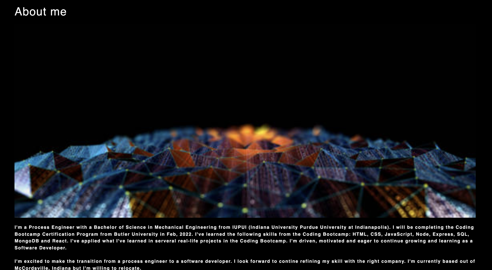

  
# React Portfolio

## License
Eclipse Public License 1.0

## Description: 
Create my own portfolio using React.  The portfolio has an About Me section, Portfolio, Contact and Resume page.  Clicking on title in the navigation section, this will employ a SPA (Single Page Application). 

The "About Me" section will have information about me.
#AboutMe

The "Portfolio" section will have a collection of projects done by me.
#Portfolio

The "Contact" section will be a form where the viewer can leave their information for me.  I've also added my email and phone number if viewer would like to contact me right away.
#Contact

The "Resume" section will have a short description of my resume and a link to download as a PDF.
#Resume

### Contents
1.  [Installation](#installation)
2.  [Usage](#usage)
3.  [Contributing](#contributing)
4.  [Tests](#tests)

## Installation:  
React

## Usage:
Init, React and web-vitals

## Contributing:
bootstrap

## Tests:
To run this project, type "node index.js" or "node index" at the command prompt (quotation marks are not required)

## Questions:
Github profile:[TCYang1006](https://github.com/TCYang1006)
If there are any additional questions about this project, please contact me at [Tcknyaj@gmail.com](Tcknyaj@gmail.com)